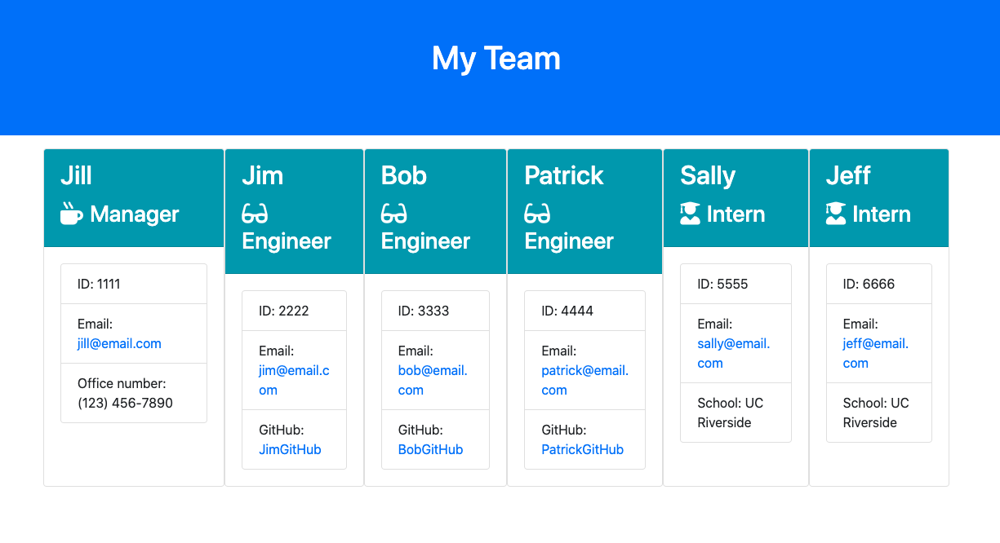

# Template Engine - Employee Summary

## Description

My assignment was to build a Node CLI that takes user-entered data about employees and generates a HTML webpage displaying that content.  I was also tasked with ensuring that I test my code, ensuring that all unit tests pass.

The application can be initialized by entering the command:

```
node app.js
```

## Table of Contents 

* [Installation](#installation)

* [Tests](#tests)

* [Steps](#steps)

* [Demo](#demo)

* [Screenshots](#screenshots)

* [Author](#author)

## Installation

To install necessary dependencies, run the following command:

```
npm install
```

## Tests

To run tests, run the following command:

```
npm run test
```

## Steps
### My Process

My first step was to install the 'package.json' file.  I then worked on 'app.js' to create questions/prompts for each employee class.  

Next, I updated my script files in the 'lib' folder.  I wrote code to define and export each class, making 'Employee' the base class.

Afterwards, I worked on the 'templates' folder and applied template literals for each class.  

As I built code for each class, I ran tests ensuring each one passed.  When all the code was written, I ran one final test and then initiated the question/prompts to generate the employee summary.

Lastly, I used [Screencastify](https://www.screencastify.com/) to record a demonstration of myself illustrating how the app functions and generates a 'team.html' file.

## Demo
### Video Demonstration Link
[Click here](https://drive.google.com/file/d/17Io5ViaBEdxWzCmWN1G5SPxhrgojX8ME/view?usp=sharing)
(After clicking link, please view in full-screen.)

## Screenshots

* **Terminal**


* **Terminal - Test**


* **Sample Employee Summary file**


## Author

* **Eric Donohue**

### Other Projects

Please visit [edonohue8](https://github.com/edonohue8/) to see more of my projects.

